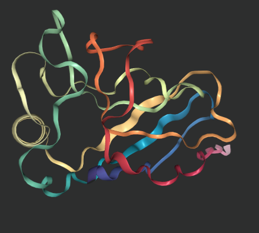
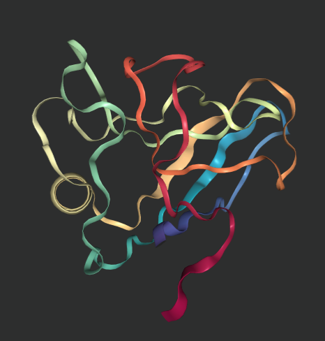

(work in progress)

# AlphaFold

This repository contains a minimal example of DeepMind's AlphaFold 2 model, that runs the model with no data and third-party requirements, for a particular protein sequence [6y4f](https://www.rcsb.org/structure/6Y4F). This repository uses their code published at `deepmind/alphafold`.

The model was run using a fasta sequence from the link above on a non-gpu based google cloud instance. The input features from the data pipeline are provided in the `6y4f` folder.

## Setup

```bash

conda create -n alphafold python=3.7 && conda activate alphafold
conda install -y -c conda-forge openmm=7.5.1 pdbfixer
pip install -r requirements.txt

cd ~/miniconda3/envs/alphafold/lib/python3.7/site-packages
patch -p0 < .../openmm.patch && cd -
# download model params below
```

## Model parameters

The AlphaFold parameters are available from
https://storage.googleapis.com/alphafold/alphafold_params_2021-07-14.tar. The following
models will be downloaded:

*   5 models which were used during CASP14, and were extensively validated for
    structure prediction quality (see Jumper et al. 2021, Suppl. Methods 1.12
    for details).
*   5 pTM models, which were fine-tuned to produce pTM (predicted TM-score) and
    predicted aligned error values alongside their structure predictions (see
    Jumper et al. 2021, Suppl. Methods 1.9.7 for details).

```bash

ROOT_DIR="data/params"
SOURCE_URL="https://storage.googleapis.com/alphafold/alphafold_params_2021-07-14.tar"
BASENAME=$(basename "${SOURCE_URL}")

wget -P "${ROOT_DIR}" "${SOURCE_URL}"
tar -xvpf "${ROOT_DIR}/${BASENAME}" -C "${ROOT_DIR}"
rm "${ROOT_DIR}/${BASENAME}"

```

## Running AlphaFold

Running `replication_script.py` should output the following expected outputs.

## AlphaFold output

The outputs will be in a subfolder of `output_dir` in `run_docker.py`. They
include the computed MSAs, unrelaxed structures, relaxed structures, ranked
structures, raw model outputs, prediction metadata, and section timings. The
`output_dir` directory will have the following structure:

```
output_dir/
    features.pkl
    ranked_{0,1,2,3,4}.pdb
    ranking_debug.json
    relaxed_model_{1,2,3,4,5}.pdb
    result_model_{1,2,3,4,5}.pkl
    timings.json
    unrelaxed_model_{1,2,3,4,5}.pdb
    msas/
        bfd_uniclust_hits.a3m
        mgnify_hits.sto
        uniref90_hits.sto
```

The contents of each output file are as follows:

*   `features.pkl` – A `pickle` file containing the input feature Numpy arrays
    used by the models to produce the structures.
*   `unrelaxed_model_*.pdb` – A PDB format text file containing the predicted
    structure, exactly as outputted by the model.
*   `relaxed_model_*.pdb` – A PDB format text file containing the predicted
    structure, after performing an Amber relaxation procedure on the unrelaxed
    structure prediction, see Jumper et al. 2021, Suppl. Methods 1.8.6 for
    details.
*   `ranked_*.pdb` – A PDB format text file containing the relaxed predicted
    structures, after reordering by model confidence. Here `ranked_0.pdb` should
    contain the prediction with the highest confidence, and `ranked_4.pdb` the
    prediction with the lowest confidence. To rank model confidence, we use
    predicted LDDT (pLDDT), see Jumper et al. 2021, Suppl. Methods 1.9.6 for
    details.
*   `ranking_debug.json` – A JSON format text file containing the pLDDT values
    used to perform the model ranking, and a mapping back to the original model
    names.
*   `timings.json` – A JSON format text file containing the times taken to run
    each section of the AlphaFold pipeline.
*   `msas/` - A directory containing the files describing the various genetic
    tool hits that were used to construct the input MSA.
*   `result_model_*.pkl` – A `pickle` file containing a nested dictionary of the
    various Numpy arrays directly produced by the model. In addition to the
    output of the structure module, this includes auxiliary outputs such as
    distograms and pLDDT scores. If using the pTM models then the pTM logits
    will also be contained in this file.

The replicated outputs of this repository are shown below (to be tested).

```python
from Bio.PDB import PDBParser
from nglview import show_biopython 

file_loc = '/Users/adityaravuri/Downloads/'

def get_view(file):
    return show_biopython(PDBParser().get_structure('6y4f', file_loc + file))

get_view('6y4f/6y4f.pdb') # true
get_view('6y4f/ranked_0.pdb') # predicted

```




## License and Disclaimer

This is not an officially supported Google product.

Copyright 2021 DeepMind Technologies Limited.

## AlphaFold Code License

Licensed under the Apache License, Version 2.0 (the "License"); you may not use
this file except in compliance with the License. You may obtain a copy of the
License at https://www.apache.org/licenses/LICENSE-2.0.

Unless required by applicable law or agreed to in writing, software distributed
under the License is distributed on an "AS IS" BASIS, WITHOUT WARRANTIES OR
CONDITIONS OF ANY KIND, either express or implied. See the License for the
specific language governing permissions and limitations under the License.

## Model Parameters License

The AlphaFold parameters are made available for non-commercial use only, under
the terms of the Creative Commons Attribution-NonCommercial 4.0 International
(CC BY-NC 4.0) license. You can find details at:
https://creativecommons.org/licenses/by-nc/4.0/legalcode
